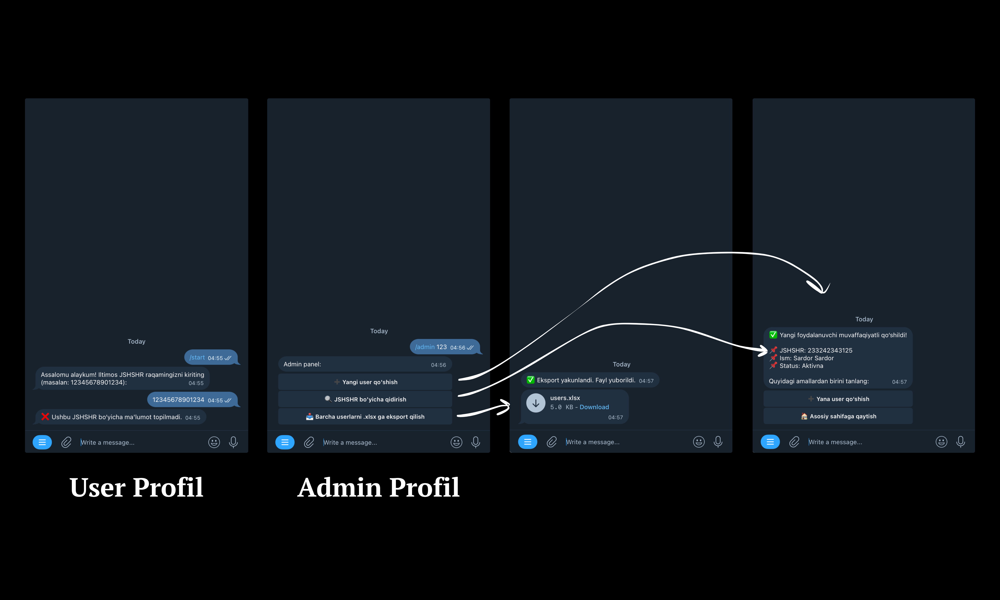

# Python Telegram Bot

**This bot is designed to collect user information — simple, flexible, and suitable for many use cases.**

<p align="center">
  
</p>

---

## Description
This repository provides a basic starter template for a Telegram bot:  
it collects user data such as name, phone number, and other details, then sends the information to the admin.  
You can easily modify and extend it to fit your own requirements.

---

## Required Libraries
```txt
python-telegram-bot==13.15
```
```txt
urllib3==1.26.5
```
```txt
opencv-python==4.11.0.86
```
```txt
openpyxl==3.1.5
```
